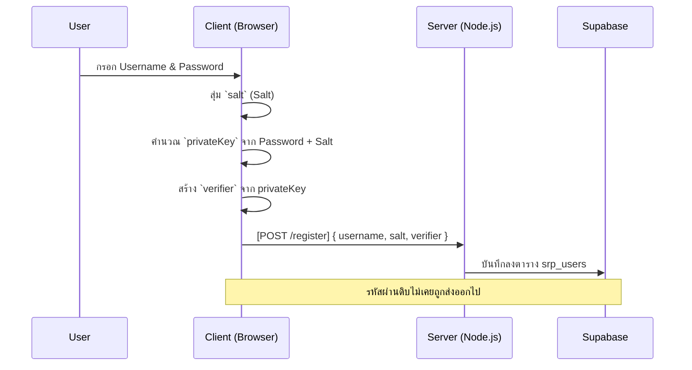
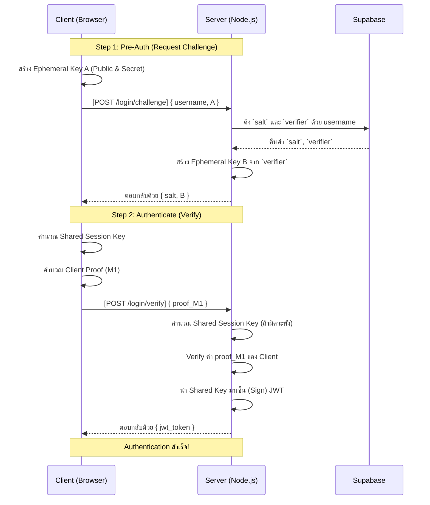
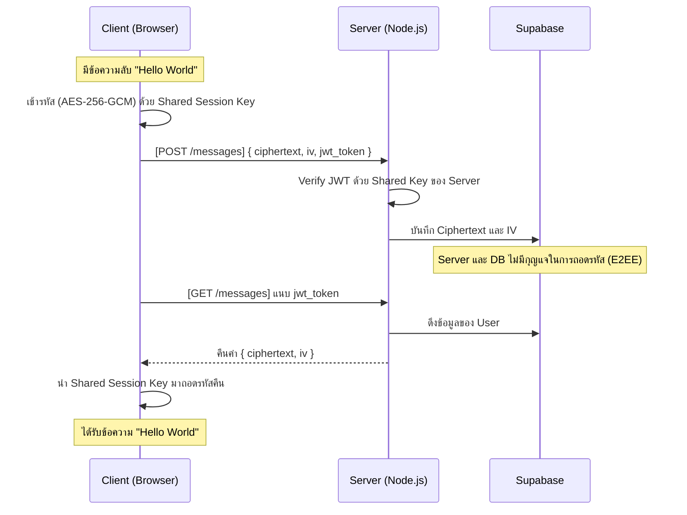

# Supabase SRP Challenge & E2EE 🔐

โปรเจกต์นี้เป็นการสาธิตการทำ **SRP Challenge (Secure Remote Password)** ร่วมกับ **End-to-End Encryption (E2EE)** และ **JWT Authentication** โดยใช้ Supabase เป็นฐานข้อมูลในการจัดเก็บ (Storage Layer)

จุดเด่นของสถาปัตยกรรมนี้คือ **"Zero-Knowledge Proof"** ทั้งฝั่ง Client และ Server สามารถเจรจา (Negotiate) เพื่อสร้าง "กุญแจเข้ารหัสลับ (Shared Session Key)" ที่เหมือนกันได้ โดยที่ **รหัสผ่านของ User จะไม่เคยถูกส่งผ่านอินเทอร์เน็ตเลย** 

กุญแจที่ได้จากการแลกเปลี่ยนนี้ จะถูกนำไปใช้ใน 2 ส่วน:
1. **Authentication**: Client ใช้กุญแจนี้เซ็น (Sign) JWT และ Server นำกุญแจเดียวกันมาเพื่อ Validate (แทนการใช้ Secret กลางตัวเดียว)
2. **Encryption (E2EE)**: Client ใช้กุญแจนี้เข้ารหัสข้อความ (AES-256-GCM) ก่อนบันทึกลงฐานข้อมูล ทำให้ Supabase ไม่สามารถอ่านข้อมูลดิบได้

---

## 🚨 Security Architecture & Risks (สำคัญมาก)

เพื่อให้ระบบมีความปลอดภัยสูงสุด **ห้ามให้ Client (Browser) ทำการดึงข้อมูล (Fetch) จาก Supabase โดยตรง** แต่ต้องใช้สถาปัตยกรรมแบบ **3-Tier** (Client ↔️ Node.js Server ↔️ Supabase)

### ความเสี่ยงหาก Client คุยกับ Supabase โดยตรง:
1. **Verifier Leak (Offline Dictionary Attack)**: ค่า `verifier` ในโปรโตคอล SRP มีสถานะเทียบเท่ากับ Password Hash หาก Client สามารถ Query ฐานข้อมูลโดยตรงได้ แฮกเกอร์จะสามารถดึง `verifier` ของผู้ใช้อื่นไปเพื่อสุ่มถอดรหัสผ่านแบบออฟไลน์ได้ ดังนั้น **Client จะต้องไม่มีสิทธิ์มองเห็น `verifier` เด็ดขาด**
2. **RLS (Row Level Security) Bypass**: ระบบนี้ใช้ Custom JWT ที่ Sign ด้วย Shared Session Key ซึ่ง Supabase ไม่รู้จัก JWT ตัวนี้ หาก Client พยายามดึงข้อมูล E2EE ข้อความด้วยตัวเอง จะไม่สามารถบังคับใช้ RLS เพื่อแยกแยะความเป็นเจ้าของข้อมูลได้ ทำให้เกิดความเสี่ยงที่ข้อมูลอาจถูกสแปมหรือถูกดึง Metadata ออกไป

### Best Practice Implementation:
* **Client (Browser)** ↔️ คุยผ่าน HTTP/REST API ↔️ **Node.js Server**
* **Node.js Server** ↔️ คุยผ่าน `supabase-js` ด้วย **Service Role Key** (Admin) ↔️ **Supabase**

---

## 🛠️ Tech Stack

- **Supabase SDK**: เป็น Backend Database สำหรับ Node.js Server
- **SRP-6a** (`secure-remote-password`): โปรโตคอลคณิตศาสตร์สำหรับการพิสูจน์รหัสผ่านแบบไม่ต้องส่งรหัส
- **Web Crypto API**: สำหรับฝั่ง Client (เบราว์เซอร์) ในการเข้ารหัส AES-GCM 
- **Jose / JSON Web Token**: ไลบรารีสำหรับสร้างและตรวจสอบ JWT 

---

## 🔄 Flow การทำงานเชิงปฏิบัติ (HTTP Request Sequence)

ในการนำไปเขียนเป็น API จริง การทำ SRP จะแบ่งเป็น **2 Steps (Pre-Auth และ Auth)** เพื่อลดการไป-กลับของ Network:

### 1. Registration Flow (ลงทะเบียน)


### 2. Login Flow (Pre-Auth & Auth)


### 3. End-to-End Encryption (E2EE)


---

## 🚀 วิธีการทดสอบระบบ (How to run)

1. ติดตั้ง Dependencies ในโปรเจกต์
```bash
npm install
```

2. ตั้งค่า Environment Variables โดยคัดลอกจาก `.env.example`
```bash
cp .env.example .env
# จากนั้นแก้ไข .env ด้วย SUPABASE_URL และ SUPABASE_SERVICE_ROLE_KEY จริง
```

3. ทดลองรันโค้ดจำลองระบบ Client-Server (เพื่อดู Log การทำงานข้าม Environment)
```bash
npm run dev        # รัน server.ts (แนะนำ — แสดง flow แยก Client/Server)
# หรือ
npx tsx index.ts  # รัน index.ts (all-in-one demo รวม Supabase)
```

4. Build สำหรับ Production
```bash
npm run build   # compile TypeScript → dist/
npm start       # รัน compiled output
```
